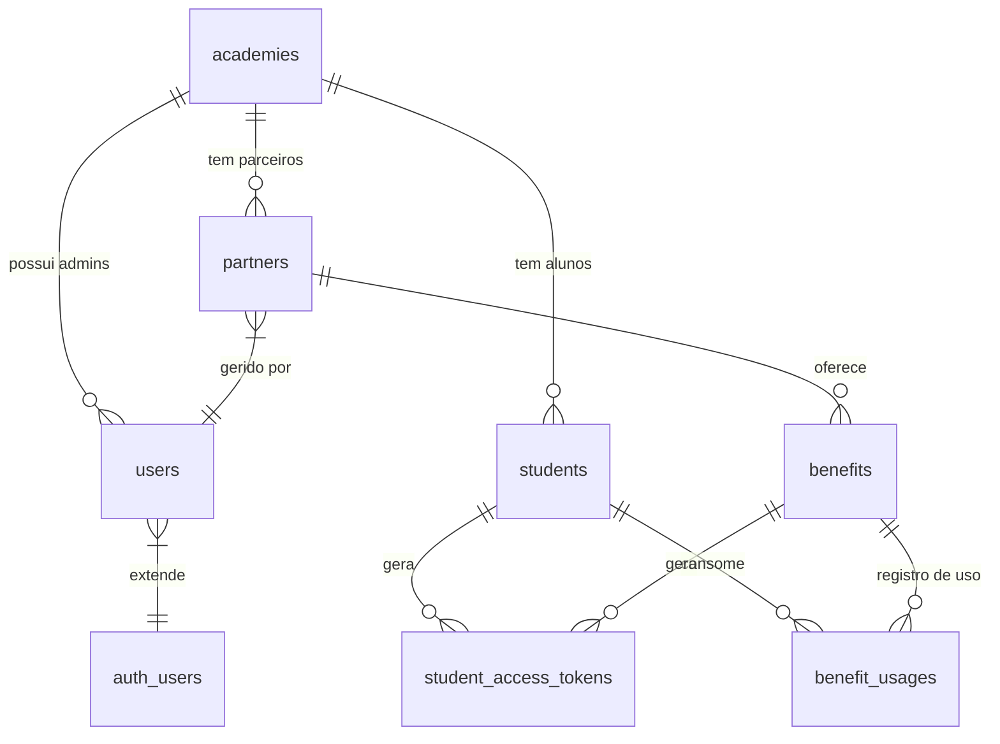

# Arquitetura de Banco de Dados (Supabase/PostgreSQL)

**Status:** V1 (MVP)
**Última Atualização:** Implementação da STORY-001

---

## 1. Visão Geral
O banco de dados utiliza PostgreSQL hospedado no Supabase. A arquitetura é **Multi-tenant**, onde todas as academias compartilham as mesmas tabelas, mas os dados são segregados logicamente através da coluna `academy_id` e reforçados por políticas de segurança (RLS - *Row Level Security*).

## 2. Diagrama de Relacionamento (ER Simplificado)

---

## 3. Dicionário de Dados

### 3.1. Tabelas Core

#### `public.academies`
A entidade raiz do sistema. Cada registro representa um cliente contratante (SaaS).
*   **PK:** `id` (uuid)
*   **Campos Chave:** `slug` (usado na URL), `primary_color` (white-label).
*   **Endereço:** `zip_code`, `street`, `number`, `neighborhood`, `city`, `state`, `latitude`, `longitude`.

#### `public.users`
Tabela de perfis que estende a tabela nativa `auth.users` do Supabase.
*   **PK/FK:** `id` (Vinculado ao Auth UID).
*   **Campos Chave:** `role` (ENUM: SUPER_ADMIN, ACADEMY_ADMIN, PARTNER), `academy_id`.

### 3.2. Entidades de Negócio

#### `public.partners`
Estabelecimentos comerciais.
*   **FK:** `academy_id` (Dono do relacionamento).
*   **FK:** `owner_id` (Usuário que loga para gerir este parceiro).
*   **Endereço:** `zip_code`, `street`, `number`, `neighborhood`, `city`, `state`, `latitude`, `longitude`.

#### `public.students`
O aluno da academia.
*   **FK:** `academy_id`.
*   **Campos Chave:** `cpf` (UNIQUE - Prevenção de fraude global).

#### `public.benefits`
As promoções criadas pelos parceiros.
*   **FK:** `partner_id`.
*   **Campos Chave:** `rules` (Texto livre com regras), `status` (ACTIVE/INACTIVE).

### 3.3. Transacional

#### `public.student_access_tokens`
Tabela volátil para os QR Codes.
*   **Campos Chave:** `token` (O código em si), `expires_at` (TTL), `status` (PENDING/VALIDATED/EXPIRED).
*   *Nota:* Registros aqui são temporários, mas mantidos para auditoria.

#### `public.benefit_usages`
Histórico permanente de "Quem usou o quê e onde".
*   **Campos Chave:** `validated_at`, `validated_by`.

---

## 4. Segurança e RLS (Planejamento)
*A implementação das policies ocorrerá na STORY-002.*

O princípio base será:
> "O usuário só pode ver linhas onde `academy_id` coincide com o seu próprio `academy_id` (encontrado em `public.users`)."

Exceções:
*   **Super Admin:** Vê tudo (Bypass RLS ou policies permissivas).
*   **Login Aluno:** Aluno vê apenas seus próprios dados e os benefícios da sua academia.