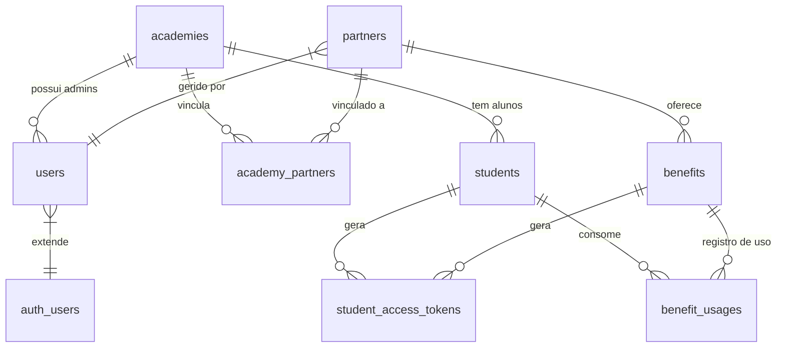

# Arquitetura de Banco de Dados (Supabase/PostgreSQL)

**Status:** V1 (MVP)
**Última Atualização:** Implementação da STORY-001

---

## 1. Visão Geral
O banco de dados utiliza PostgreSQL hospedado no Supabase. A arquitetura é **Multi-tenant**, onde todas as academias compartilham as mesmas tabelas, mas os dados são segregados logicamente através da coluna `academy_id` e reforçados por políticas de segurança (RLS - *Row Level Security*).

Exceção a partir do PROJ-006: A tabela `partners` é GLOBAL, e o vínculo com `academies` é feito via tabela associativa `academy_partners`.

## 2. Diagrama de Relacionamento (ER Simplificado)

---

## 3. Dicionário de Dados

### 3.1. Tabelas Core

#### `public.academies`
A entidade raiz do sistema. Cada registro representa um cliente contratante (SaaS).
*   **PK:** `id` (uuid)
*   **Campos Chave:** `slug` (usado na URL), `primary_color` (white-label).
*   **Theming (PROJ-009):** `color_primary`, `color_secondary`, `color_background`, `color_surface`, `color_text_primary`, `color_text_secondary` (Todos Nullable).
*   **Endereço:** `zip_code`, `street`, `number`, `neighborhood`, `city`, `state`, `latitude`, `longitude`.
*   **Ciclo de Vida (PROJ-013):** `status` (ENUM: ACTIVE, INACTIVE, SUSPENDED, MAINTENANCE) - Por padrão 'ACTIVE'.
*   **Financeiro (PROJ-013):** `due_day` (Dia Vencimento 1-31), `last_payment_date` (Data Pagamento).

#### `public.users`
Tabela de perfis que estende a tabela nativa `auth.users` do Supabase.
*   **PK/FK:** `id` (Vinculado ao Auth UID).
*   **Campos Chave:** `role` (ENUM: SUPER_ADMIN, ACADEMY_ADMIN, PARTNER), `academy_id`.

### 3.2. Entidades de Negócio

#### `public.partners` (Refatorado PROJ-006)
Estabelecimentos comerciais (Global). NÃO possui mais `academy_id`.
*   **PK:** `id` (uuid).
*   **Campos Chave:** `cnpj` (UNIQUE), `name`.
*   **FK:** `owner_id` (Usuário que loga para gerir este parceiro).
*   **Endereço:** `zip_code`, `street`, `number`, `neighborhood`, `city`, `state`, `latitude`, `longitude`.
*   **Perfil Rico (PROJ-010):**
    *   `whatsapp`, `instagram`, `website`, `phone` (Contatos).
    *   `opening_hours` (JSONB - Horários).
    *   `amenities` (Array Text - Comodidades).
    *   `gallery_urls` (Array Text - Fotos).

#### `public.academy_partners` (Novo - PROJ-006)
Tabela associativa que vincula Academias a Parceiros (N:N).
*   **PK:** `id`.
*   **FK:** `academy_id` (Academia que tem o vínculo).
*   **FK:** `partner_id` (O parceiro vinculado).
*   **Campos Chave:** `status` (ACTIVE/INACTIVE).

#### `public.students`
O aluno da academia.
*   **FK:** `academy_id`.
*   **Campos Chave:** `cpf` (UNIQUE - Prevenção de fraude global).

#### `public.benefits`
As promoções criadas pelos parceiros.
*   **FK:** `partner_id`.
*   **Campos Chave:** `rules` (Texto livre com regras), `status` (ACTIVE/INACTIVE).
*   **Promoções Avançadas (PROJ-012):**
    *   `type` (TEXT): Tipo da promoção (STANDARD, BOGO, etc).
    *   `configuration` (JSONB): Detalhes do benefício (valor, qtd).
    *   `constraints` (JSONB): Regras de validação (horário, canal).

### 3.3. Transacional

#### `public.student_access_tokens`
Tabela volátil para os QR Codes.
*   **Campos Chave:** `token` (O código em si), `expires_at` (TTL), `status` (PENDING/VALIDATED/EXPIRED).
*   **Analytics:** `estimated_economy` (DECIMAL) - Valor calculado automaticamente via Trigger.
*   *Nota:* Registros aqui são temporários, mas mantidos para auditoria.

#### `public.benefit_usages`
Histórico permanente de "Quem usou o quê e onde".
*   **Campos Chave:** `validated_at`, `validated_by`.

### 3.4. Analytics (PROJ-014)

#### `public.analytics_daily_academy_metrics`
Estatísticas diárias pré-calculadas para dashboards rápidos.
*   **PK:** `date`, `academy_id`.
*   **Campos:** `vouchers_generated`, `active_students`, `estimated_economy`.

#### `public.analytics_partner_performance`
Estatísticas mensais de engajamento por parceiro.
*   **PK:** `month` (Primeiro dia), `partner_id`, `academy_id`.
*   **Campos:** `vouchers_generated`, `views` (futuro).

### 3.5. Funções RPC
*   `get_student_economy_summary(p_student_id UUID)`: Retorna total economizado e qtd vouchers.
*   `get_student_voucher_history(p_student_id UUID, limit, offset)`: Retorna lista de vouchers com nome/logo do parceiro.
*   `get_academy_dashboard_metrics(p_academy_id UUID)`: Retorna KPIs (Economia, Vouchers) do mês atual e comparação com anterior.
*   `get_academy_partners_ranking(p_academy_id UUID, start_date, end_date)`: Top 10 parceiros por volume e economia.

---

## 4. Segurança e RLS (Atualizado PROJ-006)

*   **Partners:** Visível se existir registro em `academy_partners` vinculado ao `academy_id` do usuário.
*   **Academy Partners:** Visível apenas para a academia dona do vínculo.
*   **Benefits:** Visível para a Academia/Aluno APENAS SE o vínculo entre a academia e o parceiro estiver `ACTIVE` na tabela `academy_partners`.
*   **Benefit Usages:** Histórico visível para a academia independentemente do status atual do parceiro (Auditoria).